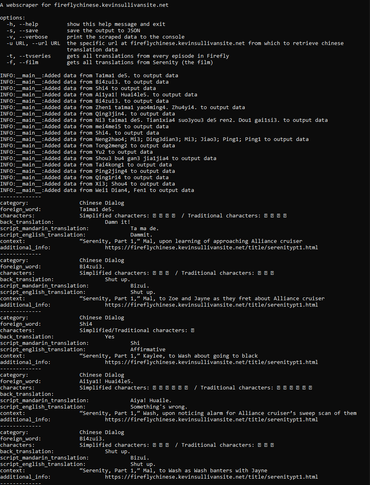

# FireflyChinese(.com) Web Scraper

An application for scraping data from an old Firefly blog that explains all the mandarin phrases being used (which is fantastic, by the way -- https://fireflychinese.com/). Needed data to seed an API I'm making soon and wanted an excuse to practice some snek along the way

## Installation

Install the required Python packages by navigating to the project's root directory and running the following command.

```base
# install requirements
pip install -r requirements.txt
```

## Usage

In a terminal, run the following command. (If no other arguments are supplied, this returns all posts' data from the site)

```bash
# Run the scraper
python scraper.py

# Help on running the script
python scraper.py --help

# View the retrieved web output in console
python scraper.py --verbose

# Save output to a JSON file with the `--save` flag
python scraper.py --save --page 1

# Specify the max number of pages from the blog to parse
python scraper.py --page 4
```


## Sample output from JSON file

```json
[
  {
        "episode_number": "5",
        "episode_title": "Safe",
        "episode_timestamp": "10:52",
        "chinese": "\u5e9f\u8bdd (f\u00e8ihu\u00e0)",
        "english_translation": "Nonsense.",
        "context": "Mal and the crew go to Jiangyin to sell their smuggled cows. They meet at the arranged spot with the buyers, who express\u00a0dissatisfaction\u00a0with the looks of the cows. They say the cows are scrawny, and Mal objects.",
        "usage": "Fei means \u201cwasted\u201d and hua means \u201cspeech,\u201d so together it means \u201can\u00a0unnecessary, nonsensical, or incorrect\u00a0statement.\u201d You could use it to reprove somebody like Mal does here, though you could also use\u00a0feihua in more playful, joking situations or for more sarcastic purposes. Like if you say to a pregnant friend on line at McDonalds, \u201cYou sure you want to eat here? It looks like you\u2019re packing on some weight there,\u201d she could sarcastically respond, \u201cFeihua\u201d to mean something like \u201cIsn\u2019t that obvious?\u201d or \u201cDon\u2019t waste your breath\u201d or \u201cNo shit, Sherlock\u201d (if she doesn\u2019t knock you out first). Said on its own here as Mal does, it\u2019s a mild expletive meaning \u201cRubbish.\u201d",
        "execution": "Mal does a reasonable job pronouncing it. Does well with the tone on fei but the hua\u00a0doesn\u2019t fall as sharply. Even so, overall, it\u2019s one of Mal\u2019s better performances thus far.",
        "episode_clip": "https://www.youtube.com/embed/Jl59tSMkbTI?feature=oembed&enablejsapi=1&origin=https://safe.txmblr.com&wmode=opaque",
        "pronunciation": "http://w.soundcloud.com/player/?url=http%3A%2F%2Fapi.soundcloud.com%2Ftracks%2F72913692&show_artwork=false"
    }
]
```